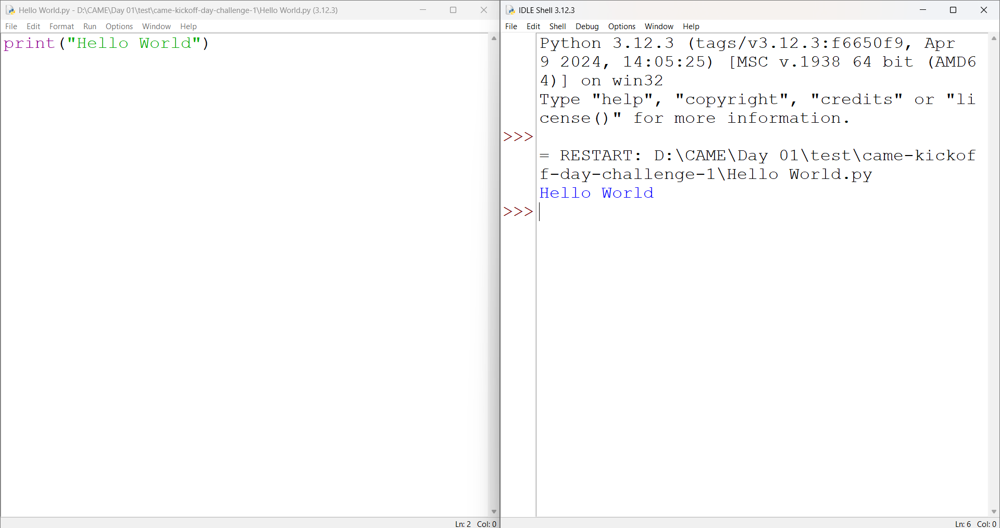

# Simple Hello World in Python

### Project Description
A simple Python program that prints **“Hello, World”** to the console. 
This is often the first step in learning Python programming and 
demonstrates basic syntax and output functionality.

### Copyright Notice
Copyright **&copy; 2025 G.A. Pubudu Janith.** All Rights Reserved.

### Prerequisite Software

- Python 3.10 or later (You can verify installation by running python --version in your terminal.)

### Setup and Run Instructions

1. Clone the repository:
```
https://github.com/CAME-01/came-kickoff-day-challenge-1.git
cd came-kickoff-day-challenge-1
```
2. Run the program:
```
python Hello World.py
```

### Official Documentation
- [**Python Official Documentation**](https://docs.python.org/3/)

### Screenshot

